# MidiEditor AI

```
███╗   ███╗██╗██████╗ ██╗███████╗██████╗ ██╗████████╗ ██████╗ ██████╗      █████╗ ██╗
████╗ ████║██║██╔══██╗██║██╔════╝██╔══██╗██║╚══██╔══╝██╔═══██╗██╔══██╗    ██╔══██╗██║
██╔████╔██║██║██║  ██║██║█████╗  ██║  ██║██║   ██║   ██║   ██║██████╔╝    ███████║██║
██║╚██╔╝██║██║██║  ██║██║██╔══╝  ██║  ██║██║   ██║   ██║   ██║██╔══██╗    ██╔══██║██║
██║ ╚═╝ ██║██║██████╔╝██║███████╗██████╔╝██║   ██║   ╚██████╔╝██║  ██║    ██║  ██║██║
╚═╝     ╚═╝╚═╝╚═════╝ ╚═╝╚══════╝╚═════╝ ╚═╝   ╚═╝    ╚═════╝ ╚═╝  ╚═╝    ╚═╝  ╚═╝╚═╝
```

**An AI-powered MIDI editor with an integrated AI copilot.**

[](https://github.com/happytunesai/MidiEditor_AI/actions/workflows/cmake-build.yml)
[](https://github.com/happytunesai/MidiEditor_AI/releases/latest)
[](LICENSE)
[](https://github.com/happytunesai/MidiEditor_AI/releases)

**Version:** 1.3.2
**Status:** Release

📥 **[Download Latest Release](https://github.com/happytunesai/MidiEditor_AI/releases/latest)**

---


## ✨ Overview

MidiEditor AI is a free MIDI editor with **MidiPilot** — an integrated AI copilot that can compose, arrange, analyze, and edit MIDI data using natural language. Tell the AI what you want in plain English and watch it build your music.

Built on top of [Meowchestra/MidiEditor](https://github.com/Meowchestra/MidiEditor), which traces back through [jingkaimori](https://github.com/jingkaimori/midieditor/), [ProMidEdit](https://github.com/PROPHESSOR/ProMidEdit), and the original [MidiEditor](https://github.com/markusschwenk/midieditor) by Markus Schwenk.

## 🤖 MidiPilot — Your AI Copilot

MidiPilot is the AI brain embedded directly in MidiEditor AI. Open the sidebar, type what you want in plain English, and it builds your music — composing, editing, transforming, and analyzing MIDI events automatically.

<p align="center">
  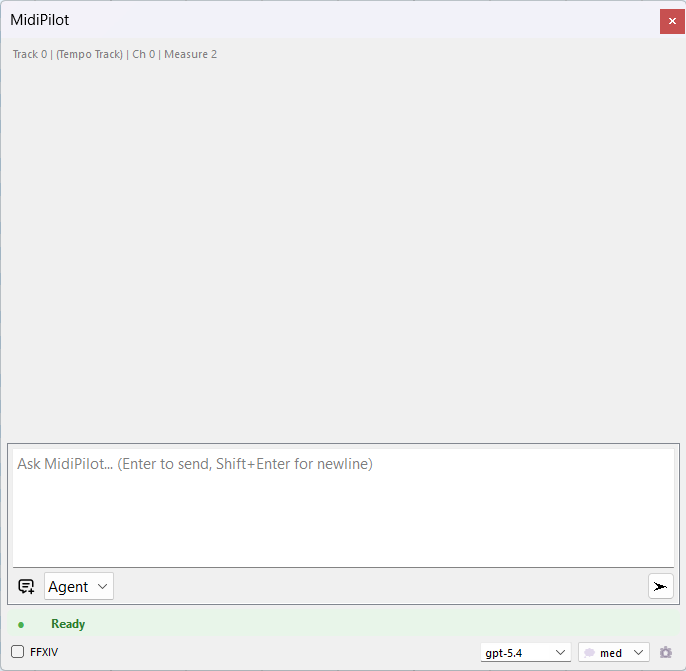
  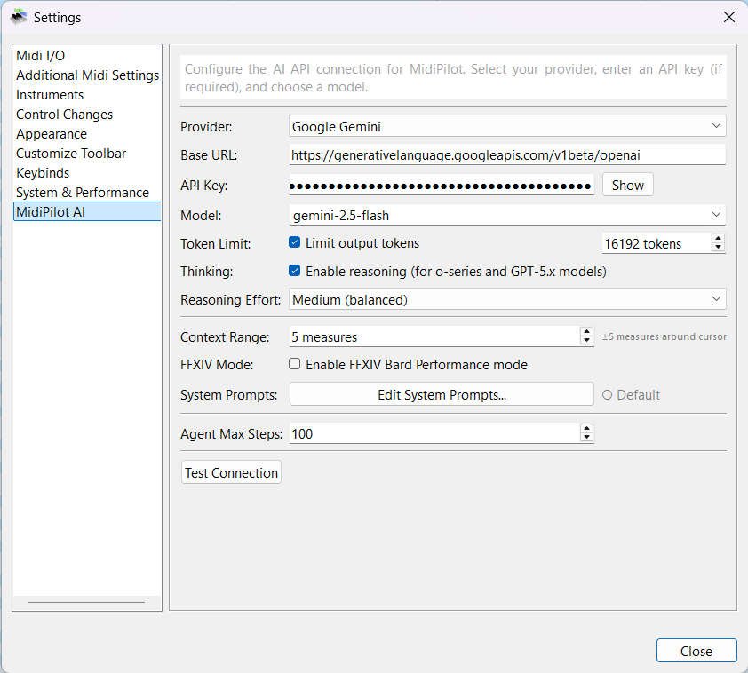
  <br/>
  <i>Chat panel &mdash; AI Settings with connection test</i>
</p>

📖 **[Full MidiPilot Documentation →](https://happytunesai.github.io/MidiEditor_AI/)**

---

## ✨ Features

| Feature | Description |
|---------|-------------|
| 🤖 **MidiPilot AI Copilot** | Compose, edit, and transform MIDI via natural language chat |
| 🎨 **Dark & Light Themes** | 7 QSS themes (Dark, Light, Sakura, AMOLED, Material Dark, System, Classic) with 10 color presets |
| 🎹 **Full MIDI Editor** | Edit, record, and play MIDI files with track/channel/event editing |
| 🎯 **Agent Mode** | Multi-step agentic loop — AI calls tools iteratively, with granular per-tool-call undo |
| 💬 **Simple Mode** | Single request/response with real-time SSE streaming for quick edits and small tasks |
| 📜 **Conversation History** | Auto-saved conversations as JSON — browse, resume, and reload past chats across sessions |
| 🌊 **Response Streaming** | Server-Sent Events (SSE) streaming in Simple mode — text appears word by word in real time |
| 💾 **Per-File AI Presets** | Save provider, model, mode, FFXIV, effort, and custom instructions per MIDI file as a sidecar `.midipilot.json` |
| 📏 **Context Window Management** | Sliding-window truncation prevents exceeding model context limits, with usage warnings at 80% |
| 🎮 **FFXIV Bard Mode** | Enforces Final Fantasy XIV Performance constraints (8 tracks, monophonic, C3–C6) |
| 🎸 **Fix XIV Channels** | One-click deterministic channel fixer — Rebuild or Preserve mode, velocity normalization, rich result summary |
| 🔀 **Split Channels to Tracks** | Convert single-track multi-channel GM MIDI files into one track per instrument with auto-naming |
| 💥 **Explode Chords to Tracks** | Split polyphonic chords into separate monophonic tracks — one note per track, ideal for FFXIV ensemble prep |
| 🎼 **Guitar Pro Import** | Open GP1–GP8 files (.gp, .gp3, .gp4, .gp5, .gpx, .gtp) directly — header-based format detection, tempo/time-sig/key extraction |
| 🔊 **Built-in FluidSynth** | Play MIDI without external softsynth — load SF2/SF3 SoundFonts, SoundFont stacking, enable/disable checkboxes, FFXIV SoundFont Mode |
| 🎶 **Audio Export** | Export MIDI to WAV, FLAC, OGG Vorbis, or MP3 using loaded SoundFonts — built-in LAME 3.100 encoder, no external tools needed |
| 📊 **MIDI Visualizer** | Real-time 16-channel equalizer bars in the toolbar with velocity-based color and smooth decay animation |
| 🔌 **Multi-Provider** | OpenAI, OpenRouter, Google Gemini, or any OpenAI-compatible endpoint |
| 🧠 **Reasoning Support** | Configurable thinking/reasoning effort (None → Extra High) |
| 📊 **Token Tracking** | Real-time token & context window usage display with multi-provider normalization |
| ✏️ **Custom System Prompts** | Edit AI behavior via JSON — no recompiling needed |
| 🔄 **Auto-Updater** | In-app updates from GitHub Releases — Update Now, After Exit, or Download Manual |
| � **Lyric Editor** | Full lyric timeline with drag, resize, split, merge, inline text editing, and tap-to-sync dialog |
| 🎤 **Lyric Visualizer** | Karaoke-style toolbar widget with left-to-right color sweep, two-line current/next phrase display |
| 🎤 **Lyric Import/Export** | Import plain text, SRT subtitles, or LRC karaoke files — export to SRT, LRC, or MIDI text events || 🔌 **MCP Server** | Built-in Model Context Protocol server — Claude Desktop, VS Code Copilot, Cursor, and any MCP client can edit MIDI directly || �🎵 **Quantization** | Event quantization and control change visualization |
| 🎤 **MIDI Recording** | Record from connected MIDI devices (keyboards, digital pianos) |

## 🏗️ Architecture

```
MidiEditor AI
├── Core Editor          → MIDI file I/O, tracks, channels, events
├── MatrixWidget         → Piano roll note editor with OpenGL rendering
├── MidiPilot            → AI copilot sidebar (chat + tools)
│   ├── AiClient         → OpenAI-compatible API client (SSE streaming)
│   ├── ConversationStore → Persistent history (JSON save/load/resume)
│   ├── EditorContext     → Musical context extraction for AI
│   ├── ToolDefinitions   → 13 MIDI manipulation tools for AI
│   └── SystemPrompts     → Customizable per-mode AI instructions
├── Appearance           → 7 QSS themes, 10 color presets, dark title bar, icon adaptation
├── Lyric Editor         → Timeline lane, inline editing, split/merge, tap-to-sync, SRT/LRC import/export
├── Lyric Visualizer     → Karaoke toolbar widget with highlight sweep and two-line display
├── MIDI Visualizer      → Real-time 16-channel equalizer widget in toolbar
├── FFXIV Module         → Bard Performance validation & drum conversion
├── FluidSynth Engine    → Built-in software synthesizer with SoundFont support
├── LAME Encoder         → Built-in MP3 encoder (LAME 3.100, static library)
├── Multi-Provider       → OpenAI / OpenRouter / Gemini / Custom / Local
├── MCP Server           → Model Context Protocol server for external AI clients
├── MIDI I/O             → RtMidi for real-time MIDI device communication
└── Settings             → Provider, model, appearance, keybinds, layout
```

## 🚀 Quick Start

### 1. Download & Run

1. Download the latest release from the [**Releases page**](https://github.com/happytunesai/MidiEditor_AI/releases/latest)
2. Extract the zip file
3. Run **MidiEditorAI.exe**

### 2. Configure AI

1. Open **Settings** (gear icon) and go to the **AI** tab
2. Select your provider (OpenAI, OpenRouter, Google Gemini, or Custom)
3. Enter your API key
4. Choose a model

### 3. Start Creating

1. Open the **MidiPilot** panel from the sidebar
2. Type a natural language instruction:
   > *"Create an 8-bar jazz waltz in Bb major with piano, bass, and drums"*
3. Press Enter and watch the AI build your music

## 🎮 FFXIV Bard Performance Mode

When the **FFXIV** checkbox is enabled, MidiPilot enforces Final Fantasy XIV constraints:

| Constraint | Rule |
|------------|------|
| 🎵 **Tracks** | Maximum 8 tracks (octet ensemble) |
| 🔊 **Polyphony** | Monophonic only — one note at a time per instrument |
| 🎹 **Range** | C3–C6 (MIDI 48–84) — MidiBard2 auto-transposes |
| 🥁 **Drums** | No drum kit — separate tonal tracks (Bass Drum, Snare, Cymbal, etc.) |
| 🎸 **Guitars** | 5 electric guitar variants via channel-based switching |
| ⚡ **Auto-Setup** | Channel pattern tool configures MidiBard2 mapping automatically |
| 🎸 **Fix X\|V Channels** | One-click toolbar button — deterministic channel fixer with Rebuild/Preserve modes and rich result summary (no AI needed) |

## 🎮 Fix X|V Channels — FFXIV Channel Fixer

The **Fix X|V Channels** button provides a deterministic channel fixer for FFXIV MIDI files — no AI needed. Open your file, click the button, and choose between **Rebuild** (full reassignment) or **Preserve** (minimal changes).

<p align="center">
  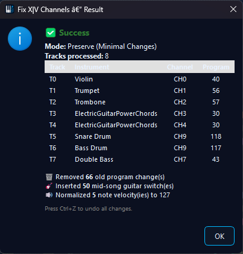
  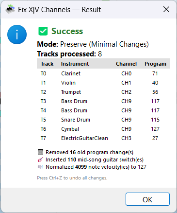
  <br/>
  <i>Mode selection dialog &mdash; Rich result summary with channel mapping and changes</i>
</p>

Find it in the toolbar or via **Tools → Fix X|V Channels**. The entire operation is a single undo action (Ctrl+Z).

---

## 🔀 Split Channels to Tracks

The **Split Channels to Tracks** tool converts single-track multi-channel GM MIDI files into one track per instrument. Perfect for files downloaded from the internet where all channels are on one track.

<p align="center">
  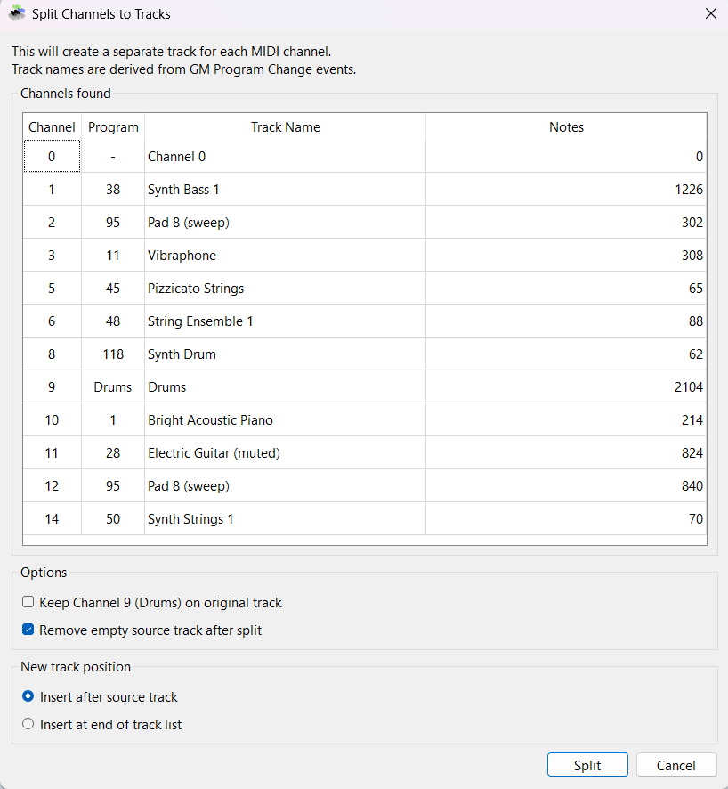
  <br/>
  <i>Preview dialog showing detected channels, GM instrument names, and note counts</i>
</p>

**Features:**
- **Auto-naming** — tracks are named from GM Program Change events (e.g. "Synth Bass 1", "Vibraphone", "Drums")
- **Channel 9 handling** — optionally keep drums on the original track
- **Flexible positioning** — insert new tracks after source or at end
- **Clean up** — optionally remove the empty source track
- **Full undo** — the entire split is a single undo action (Ctrl+Z)

Find it in the toolbar or via **Tools → Split Channels to Tracks** (Ctrl+Shift+E).

📖 **[Split Channels Documentation →](https://happytunesai.github.io/MidiEditor_AI/split-channels.html)**

---

## 🎸 Explode Chords to Tracks

The **Explode Chords to Tracks** tool takes polyphonic chords and splits them into separate monophonic tracks — one note per voice. Ideal for preparing FFXIV ensemble arrangements where each instrument must be monophonic.

Find it in the toolbar or via **Tools → Explode Chords to Tracks**.

> **Note:** This tool was inherited from [Meowchestra/MidiEditor](https://github.com/Meowchestra/MidiEditor). MidiEditor AI added a toolbar icon for quick access.

---

## � Lyric Editor & Visualizer

MidiEditor AI includes a full **Lyric Editor** with a dedicated timeline lane below the piano roll and a **Lyric Visualizer** karaoke widget in the toolbar.

### Lyric Timeline

A visual lane showing lyric blocks aligned to the MIDI timeline. Edit lyrics directly:

- **Drag & resize** blocks to adjust timing
- **Double-click** for inline text editing
- **Right-click** context menu: Edit, Delete, Split at Cursor, Merge with Next, Insert Before/After
- **Multi-select** with Shift+Click
- **Keyboard shortcut:** Ctrl+L to toggle visibility

### Tap-to-Sync Dialog

Timing lyrics to music is easy — play the song and **hold Space** while each phrase is sung:

- Press = phrase starts, Release = phrase ends
- Real-time timeline with colored sync markers
- Teleprompter view showing the next 8 upcoming phrases
- Undo Last to correct mistakes on the fly

### Import & Export

| Format | Import | Export |
|--------|--------|--------|
| **Plain Text** | ✓ (one phrase per line) | — |
| **SRT Subtitles** | ✓ (timestamps → MIDI ticks) | ✓ |
| **LRC Karaoke** | ✓ (with MidiBard2 extension) | ✓ (with metadata) |
| **MIDI Text Events** | ✓ (auto on file load) | ✓ (Type 0x05 Lyric) |

Find all options under **Tools → Lyrics**.

### Lyric Visualizer

A karaoke-style toolbar widget that displays the current phrase with a left-to-right color sweep highlight and a preview of the next phrase below. Auto-hides when no lyrics are loaded.

All lyric operations support **full undo/redo** (Ctrl+Z / Ctrl+Y).

📖 **[Lyric Editor Documentation →](https://happytunesai.github.io/MidiEditor_AI/lyrics.html)**

---

## �🎼 Guitar Pro Import

MidiEditor AI can open **Guitar Pro** files directly — all versions from GP1 through GP8 are supported. Files are converted to MIDI on-the-fly with tempo, time signature, key signature, and instrument mapping preserved.

**Supported formats:**

| Format | Extensions | Parser |
|--------|-----------|--------|
| GP1 / GP2 | `.gtp` | Gp12Parser |
| GP3 / GP4 / GP5 | `.gp3`, `.gp4`, `.gp5` | Gp345Parser |
| GP6 / GP7 / GP8 | `.gpx`, `.gp` | Gp678Parser (ZIP+XML) |

**Features:**
- **Header-based detection** — file format is identified by magic bytes, not file extension
- **Full metadata** — tempo, time signature, key signature, tuning, and track names are extracted
- **Instrument mapping** — Guitar Pro instruments are mapped to General MIDI program numbers
- **Effects** — bends, slides, hammer-on/pull-off, vibrato, and harmonics are converted where possible

---

## 🎨 Themes & Appearance

MidiEditor AI ships with **7 application themes** and **10 note bar color presets** — switch instantly via **Settings → Appearance**.

| Theme | Style |
|-------|-------|
| **Dark** | Deep blue-black (`#0d1117` bg, `#58a6ff` accent) — default |
| **Light** | Clean white for daytime use |
| **Sakura** | Cherry blossom pink with rose accents and tinted piano keys |
| **AMOLED** | Pure black with orange accents — optimized for OLED screens |
| **Material Dark** | Charcoal with teal accents, Material Design aesthetic |
| **System** | Auto-detects your OS dark/light preference |
| **Classic** | Original system-native look, unchanged |

<p align="center">
  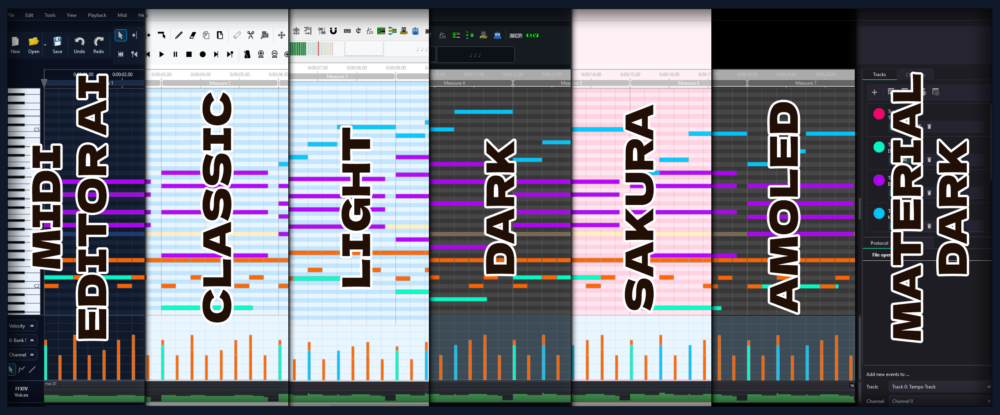
  <br/>
  <i>All 7 themes side by side</i>
</p>

**Additional features:**
- **10 color presets** for note bars — Default, Rainbow, Neon, Fire, Ocean, Pastel, Sakura, AMOLED, Emerald, Punk
- **MIDI Visualizer** — real-time 16-channel equalizer bars in the toolbar with velocity-based green-to-blue color interpolation and smooth decay animation
- **Dark title bar** on Windows via DWM API
- **Automatic icon adaptation** — toolbar icons recolor for visibility in dark themes
- Theme changes trigger an automatic restart with confirmation dialog

📖 **[Themes Documentation →](https://happytunesai.github.io/MidiEditor_AI/themes.html)**

---

## 🔊 Built-in FluidSynth Synthesizer

MidiEditor AI includes a **built-in software synthesizer** powered by [FluidSynth](https://www.fluidsynth.org/). No external softsynth (like VirtualMIDISynth or CoolSoft) is needed — just select *FluidSynth (Built-in Synthesizer)* as your MIDI output.

<p align="center">
  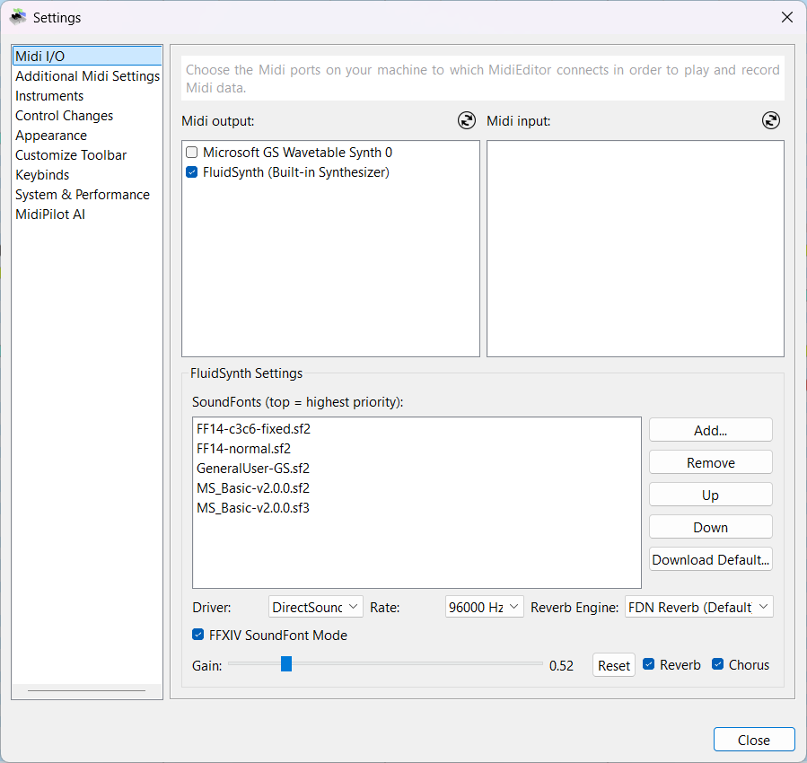
  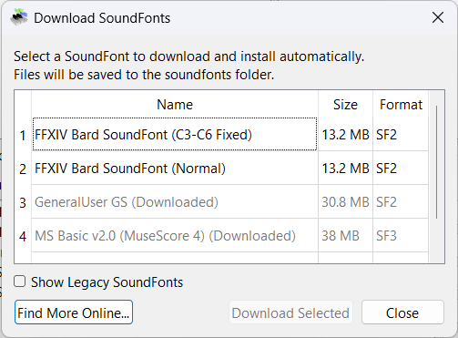
  <br/>
  <i>SoundFont management &mdash; Download dialog for recommended SoundFonts</i>
</p>

**Key features:**
- **SoundFont management** — load multiple SF2/SF3 files with priority-based stacking
- **Enable/disable checkboxes** — temporarily disable a SoundFont without removing it; state persists across sessions
- **FFXIV auto-toggle** — FFXIV SoundFont Mode automatically enables/disables when you check/uncheck SoundFonts with "ff14" or "ffxiv" in the name
- **One-click download** — built-in download dialog for General MIDI and FFXIV SoundFonts
- **FFXIV SoundFont Mode** — treats all 16 channels as melodic (bank 0) and auto-injects drum program changes based on track names, so FFXIV percussion plays correctly without modifying the MIDI file
- **Audio driver fallback** — if the preferred driver fails, automatically tries wasapi → dsound → waveout → sdl3 → sdl2
- **Audio settings** — configurable audio driver, gain, sample rate, reverb & chorus

📖 **[FluidSynth Documentation →](https://happytunesai.github.io/MidiEditor_AI/soundfont.html)**

---

## 🎶 Audio Export

MidiEditor AI can render your MIDI files to audio using the built-in FluidSynth synthesizer. Export to **WAV**, **FLAC**, **OGG Vorbis**, or **MP3** — no external tools required.

**Key features:**
- **Four formats** — WAV (uncompressed), FLAC (lossless), OGG Vorbis (lossy), MP3 (lossy via built-in LAME 3.100)
- **Quality presets** — Draft (22 kHz), CD (44.1 kHz), Studio (48 kHz), Hi-Res (96 kHz)
- **Flexible range** — export the full song, current selection, or custom measure range
- **Selection export** — right-click selected notes → "Export Selection as Audio..."
- **Background rendering** — progress dialog with cancel support for both FluidSynth and LAME phases
- **Completion dialog** — Open File, Open Folder, or Close after export finishes
- **Guitar Pro support** — GP3–GP8 files export seamlessly (temporary MIDI conversion is handled automatically)

Export via **File → Export Audio** (Ctrl+Shift+E), the right-click context menu on selections, or the **Export Audio** button in the FluidSynth settings panel.

📖 **[Audio Export Documentation →](https://happytunesai.github.io/MidiEditor_AI/export-audio.html)**

---

## 🔄 Auto-Updater

MidiEditor AI checks for new versions on GitHub at every startup. When an update is available, you get four options:

| Button | Action |
|--------|--------|
| **Update Now** | Downloads, saves your work, replaces in-place, restarts automatically |
| **After Exit** | Downloads in background, applies when you close the app |
| **Download Manual** | Opens the release page in your browser |
| **Skip** | Dismiss — reminded again next startup |

<p align="center">
  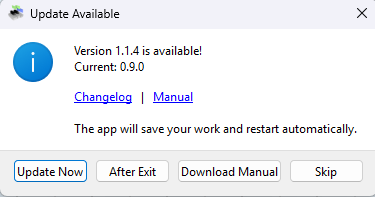
  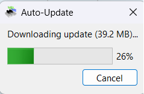
  <br/>
  <i>Update dialog &mdash; Download progress</i>
</p>

📖 **[Auto-Update Documentation →](https://happytunesai.github.io/MidiEditor_AI/setup.html#updates)**

---

## 🌐🔌 Supported Providers

| Provider | Base URL | API Key | Free Tier |
|----------|----------|---------|-----------|
| **OpenAI** | `api.openai.com/v1` | Required | Limited |
| **OpenRouter** | `openrouter.ai/api/v1` | Required | Free models available |
| **Google Gemini** | `generativelanguage.googleapis.com` | Required | 15 RPM, 1M TPM |
| **Ollama** (local) | `localhost:11434/v1` | No | Unlimited |
| **LM Studio** (local) | `localhost:1234/v1` | No | Unlimited |
| **Custom** | User-specified | User-specified | Varies |

## 🛠️ MidiPilot Tools

The AI has access to 15 tools for inspecting and modifying MIDI files:

| Tool | Description |
|------|-------------|
| `get_editor_state` | Read file info, tracks, tempo, time signature, cursor |
| `get_track_info` | Get details about a specific track |
| `create_track` / `rename_track` / `set_channel` | Manage tracks |
| `insert_events` / `replace_events` / `delete_events` | Add, modify, remove MIDI events |
| `query_events` | Read events in a tick range on a track |
| `move_events_to_track` | Move events between tracks |
| `set_tempo` / `set_time_signature` | Change tempo and meter |
| `setup_channel_pattern` | Auto-configure MidiBard2 channel mapping *(FFXIV)* |
| `validate_ffxiv` | Check FFXIV rule compliance *(FFXIV)* |
| `convert_drums_ffxiv` | Convert GM drums to FFXIV tonal percussion *(FFXIV)* |

> **Tip:** The **Fix X\|V Channels** toolbar button runs the same channel setup deterministically — no AI call needed. Find it in **Tools → Fix X\|V Channels** or on the toolbar.

---

## 🔌 MCP Server (Model Context Protocol)

MidiEditor AI includes a built-in **MCP server** that exposes all MidiPilot tools to external AI clients. Any MCP-compatible client — **Claude Desktop**, **VS Code Copilot**, **Cursor**, **Windsurf**, and others — can connect and edit MIDI files directly.

### How It Works

1. Enable the MCP server in **Settings → AI → MCP Server**
2. Copy the MCP config JSON to your AI client's configuration
3. The client discovers all 15 tools automatically and can compose, edit, and analyze MIDI

### Quick Setup

```json
{
  "mcpServers": {
    "midieditor": {
      "url": "http://localhost:9420/mcp",
      "headers": {
        "Authorization": "Bearer YOUR_TOKEN_HERE"
      }
    }
  }
}
```

### Features

- **Streamable HTTP** transport (MCP 2025-03-26) on a single `/mcp` endpoint
- **All 15 MidiPilot tools** exposed — same tools the built-in AI uses
- **3 MCP Resources** — `midi://state`, `midi://tracks`, `midi://config` for read-only context
- **Client identification** — Protocol panel shows which client made each edit (e.g. "MidiPilotMCP (VS Code Copilot Claude Opus 4.6)")
- **Security** — localhost-only, Origin validation, optional auth token, rate limiting (100 calls/min)
- **FFXIV-aware** — FFXIV-specific tools appear/disappear automatically when FFXIV mode is toggled

📖 **Full MCP Server Documentation** is available in the built-in manual under *Help → Manual → MCP Server*.

## ⚙️ Settings

| Setting | Description |
|---------|-------------|
| **Provider & Model** | Select AI provider and model. Custom models can be typed manually. |
| **Thinking / Reasoning** | Toggle reasoning and set effort level (None → Extra High) |
| **Context Range** | Measures before/after cursor included as musical context (0–50) |
| **Agent Max Steps** | Maximum tool calls per Agent request (5–100, default 50) |
| **Output Token Limit** | Optional cap on output tokens to control costs |
| **System Prompts** | Customize AI behavior for each mode via built-in editor |
| **Per-File Presets** | Save/auto-load provider, model, mode, FFXIV, effort, and custom instructions per MIDI file |

## 🎬 Examples

Compositions created entirely by AI in **Agent mode** — from a single text prompt to a finished MIDI file.

---

---

### Metal Mozart — Agent Mode (Gemini 3.1 Pro)

> *"Create a metal version of Mozart's Eine kleine Nachtmusik with shredding guitars, bass, strings, and a drum kit. Make it 20 measures long, with a guitar solo in the middle."*

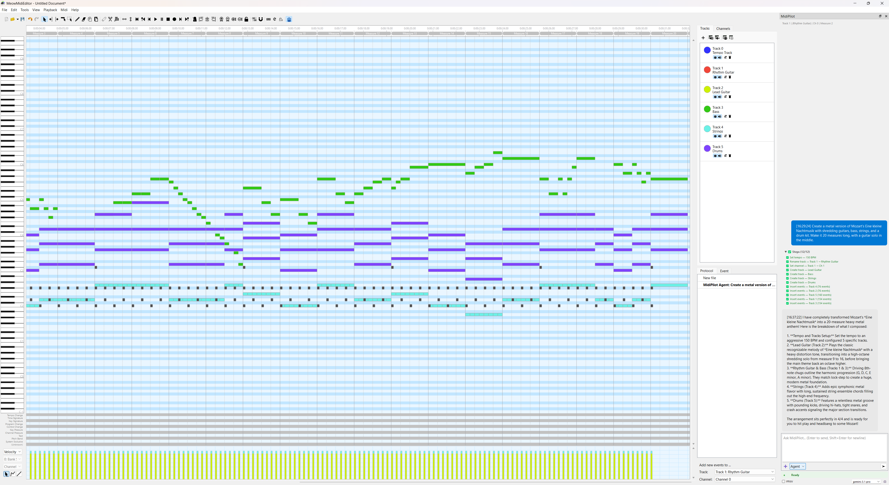

https://github.com/user-attachments/assets/f0113a74-14d4-47c1-945e-6fc61fa2fbc6

📥 [Download MIDI](examples/Mozart_by_gemini_agent.mid)

---

### Metal Mozart — FFXIV Octett Mode (Gemini 3.1 Pro)

> *"Create a metal version of Mozart's Eine kleine Nachtmusik with shredding guitars, bass, strings, and a drum kit. Make it 20 measures long, with a guitar solo in the middle. 8 Tracks ready for a FFXIV Octett"*

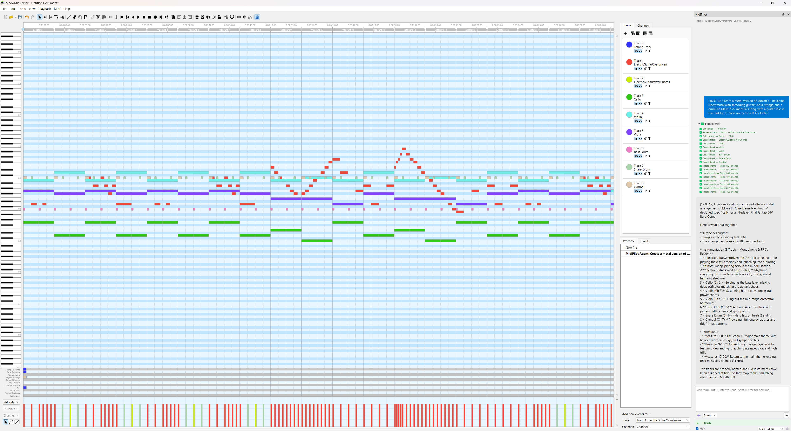

https://github.com/user-attachments/assets/789ad60b-69d1-46aa-acce-4970f6e2acf2

📥 [Download MIDI](examples/Mozart_by_gemini_agent_FFXIV.mid)

---

## 🔨 Building from Source

### Requirements

- **Windows 10/11**
- **Visual Studio 2019/2022** (MSVC Build Tools)
- **Qt 6.5.3** (with Multimedia module)
- **CMake 3.20+**

### Build

```bash
# Clone with submodules (RtMidi)
git clone --recursive https://github.com/happytunesai/MidiEditor_AI.git
cd MidiEditor_AI

# Configure and build
cmake -S . -B build -G "NMake Makefiles" -DCMAKE_BUILD_TYPE=Release
cmake --build build --config Release
```

The executable will be at `build/bin/MidiEditorAI.exe` with Qt DLLs auto-deployed.

## 📂 Project Structure

```
MidiEditor_AI/
├── src/
│   ├── main.cpp              # Application entry point
│   ├── gui/                   # UI components
│   │   ├── MainWindow.*       # Main application window
│   │   ├── MidiPilotWidget.*  # AI copilot sidebar
│   │   ├── AiSettingsWidget.* # AI provider/model settings
│   │   ├── Appearance.*       # Theme management, color presets, DWM dark title bar
│   │   ├── MidiVisualizerWidget.* # Real-time 16-channel equalizer bars
│   │   ├── LyricTimelineWidget.* # Lyric timeline lane (edit, drag, split, merge)
│   │   ├── LyricVisualizerWidget.* # Karaoke toolbar widget (highlight sweep)
│   │   ├── LyricSyncDialog.*  # Tap-to-sync dialog (teleprompter)
│   │   ├── LyricImportDialog.* # Plain text import with preview
│   │   ├── MatrixWidget.*     # Piano roll editor
│   │   ├── AboutDialog.*      # Credits & version info
│   │   ├── themes/            # QSS theme files (dark, light, sakura, amoled, materialdark)
│   │   └── ...                # 40+ GUI components
│   ├── ai/                    # AI integration
│   │   ├── AiClient.*         # Multi-provider API client with SSE streaming
│   │   ├── McpServer.*        # Built-in MCP server (Streamable HTTP, JSON-RPC 2.0)
│   │   └── ConversationStore.*# Persistent conversation history (JSON save/load/resume)
│   ├── midi/                  # MIDI file I/O & devices
│   │   ├── MidiFile.*         # MIDI file read/write
│   │   ├── FluidSynthEngine.* # Built-in synthesizer + audio export
│   │   ├── LameEncoder.*      # MP3 encoding (LAME 3.100)
│   │   ├── MidiInput.*        # Real-time MIDI input (RtMidi)
│   │   └── ...
│   ├── converter/             # File format converters
│   │   ├── GuitarPro/         # GP1–GP8 import (Gp12, Gp345, Gp678 parsers)
│   │   ├── SrtParser.*        # SRT subtitle parser
│   │   └── LrcExporter.*      # LRC karaoke import/export
│   ├── MidiEvent/             # MIDI event types
│   ├── protocol/              # Undo/redo protocol
│   └── tool/                  # Editor tools (select, draw, etc.)
├── run_environment/           # Runtime assets (graphics, metronome, icons)
├── manual/                    # HTML documentation & screenshots
├── examples/                  # AI-generated MIDI examples
├── .github/workflows/         # CI/CD (build + release)
├── CMakeLists.txt             # CMake build configuration
└── build.bat                  # Local build script
```

## 🤝 Credits & Acknowledgments

MidiEditor AI is built on the shoulders of these projects:

| Project | Author | Link |
|---------|--------|------|
| **MidiEditor** (upstream) | Meowchestra | [github.com/Meowchestra/MidiEditor](https://github.com/Meowchestra/MidiEditor) |
| **MidiEditor** (original) | Markus Schwenk | [github.com/markusschwenk/midieditor](https://github.com/markusschwenk/midieditor) |
| **ProMidEdit** | PROPHESSOR | [github.com/PROPHESSOR/ProMidEdit](https://github.com/PROPHESSOR/ProMidEdit) |
| **jingkaimori fork** | jingkaimori | [github.com/jingkaimori/midieditor](https://github.com/jingkaimori/midieditor) |

**Third-party resources:**
- 3D icons by Double-J Design
- Flat icons by Freepik
- Metronome sound by Mike Koenig
- RtMidi library by Gary P. Scavone

See the full list of contributors in the [CONTRIBUTORS](CONTRIBUTORS) file.

## 📄 License

This project is licensed under the [GNU General Public License v3.0](LICENSE).

## 👀 Contact

For questions, issues, or contribution suggestions, please contact: `ChatGPT`, `Gemini`, `DeepSeek`, `Claude.ai` 🤖
or try to dump it [here](https://github.com/happytunesai/MidiEditor_AI/issues)! ✅

**GitHub:** [github.com/happytunesai/MidiEditor_AI](https://github.com/happytunesai/MidiEditor_AI)

---

*Created with ❤️ + AI*


