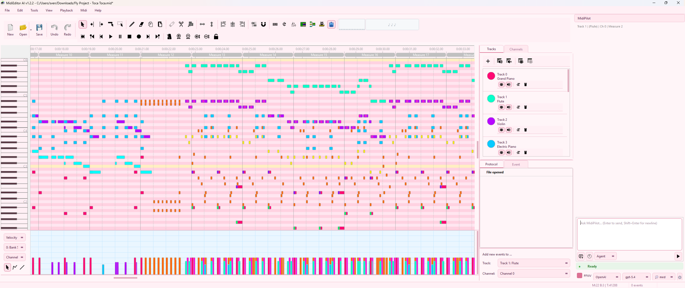

# MidiEditor AI

Downloads: [latest release](https://github.com/happytunesai/MidiEditor_AI/releases)

AI-powered MIDI editor with **MidiPilot** — an integrated AI copilot that can compose, arrange, analyze, and edit MIDI data via natural language. Built on top of [Meowchestra/MidiEditor](https://github.com/Meowchestra/MidiEditor), which is based on [jingkaimori's fork](https://github.com/jingkaimori/midieditor/) of [ProMidEdit](https://github.com/PROPHESSOR/ProMidEdit), built on top of [MidiEditor](https://github.com/markusschwenk/midieditor) by Markus Schwenk.

### Introduction

MidiEditor is a free software providing an interface to edit, record, and play midi data.

The editor is able to open existing midi files and modify their content. New files can be created and the user can enter his own composition by either recording Midi data from a connected Midi device (e.g., a digital piano or a keyboard) or by manually creating new notes and other Midi events. The recorded data can be easily quantified and edited afterwards using MidiEditor.

### Features

* Easily edits, records and plays Midi files
* Can be connected to any Midi port (e.g., a digital piano or a synthesizer)
* Tracks, channels and Midi events can be edited
* Event quantization
* Control changes can be visualized
* Free
* Available for Windows

---

## MidiPilot - AI-Powered MIDI Assistant

MidiPilot is an integrated AI copilot that can compose, edit, and transform MIDI data using natural language. It is embedded directly in the MidiEditor interface and communicates with AI APIs to understand musical intent and execute changes on the active MIDI file.

### Getting Started

1. Open **Settings** and select your AI provider (OpenAI, OpenRouter, Google Gemini, or Custom).
2. Enter your API key for the selected provider.
3. Select a model and configure reasoning effort.
4. Open the **MidiPilot** panel from the sidebar.
5. Type a natural language instruction (e.g. *"Create an 8-bar jazz waltz in Bb major"*) and press Enter.

### Modes

| Mode | Description |
|------|-------------|
| **Simple** | Single request/response. The model generates all tool calls in one shot. Best for small edits and quick tasks. |
| **Agent** | Multi-step agentic loop. The model calls tools iteratively, inspecting results between steps. The maximum number of steps is configurable in Settings (default: 50). |

### FFXIV Bard Performance Mode

When the **FFXIV** checkbox is enabled, MidiPilot enforces the constraints of Final Fantasy XIV's Bard Performance system:

- **8-track maximum** (octet ensemble)
- **Monophonic tracks** — one note at a time per instrument
- **Note range C3–C6** (MIDI 48–84) — MidiBard2 auto-transposes to each instrument's native range
- **No drum kit** — percussion is split into separate tonal tracks (Bass Drum, Snare Drum, Cymbal, Timpani, Bongo)
- **Guitar switches** — 5 electric guitar variants can share a track slot using channel-based switching
- **Automatic channel pattern setup** — assigns unique channels and program_change events for MidiBard2 compatibility
- **Velocity is ignored** — FFXIV plays all notes at the same loudness

### Supported Providers

MidiPilot supports multiple AI providers through OpenAI-compatible APIs:

| Provider | Description |
|----------|-------------|
| **OpenAI** | Direct OpenAI API (GPT-5.x, GPT-4.x, o-series) |
| **OpenRouter** | Aggregator supporting OpenAI, Anthropic, Google, Meta models |
| **Google Gemini** | Native Gemini API via OpenAI compatibility layer (Gemini 2.5, 3.x) |
| **Custom** | Any OpenAI-compatible endpoint (local or remote) |

API keys are stored per provider — switching providers restores the previously saved key.

### Supported Models

MidiPilot supports a range of models with configurable reasoning effort:

- **gpt-5.4 / gpt-5.4-mini / gpt-5.4-nano** — Latest generation, reasoning-capable
- **gpt-5 / gpt-5-mini** — Previous generation reasoning models
- **gpt-4.1-nano / gpt-4.1-mini / gpt-4.1** — Efficient non-reasoning models
- **gpt-4o / gpt-4o-mini** — Fast general-purpose models
- **o4-mini** — Dedicated reasoning model
- **gemini-2.5-flash / gemini-2.5-pro** — Google Gemini with thinking support
- **gemini-3-flash / gemini-3.1-pro** — Latest Gemini generation
- **anthropic/claude-sonnet-4** — Via OpenRouter
- **meta-llama/llama-4-maverick** — Via OpenRouter

### Settings

| Setting | Description |
|---------|-------------|
| **Provider & Model** | Select AI provider and model. Custom models can be typed manually. |
| **Thinking / Reasoning Effort** | Toggle reasoning and set effort level (None, Low, Medium, High, Extra High). |
| **Context Range** | Number of measures before and after the cursor to include as musical context (0–50). |
| **Agent Max Steps** | Maximum number of tool calls per Agent request (5–100, default 50). |
| **Output Token Limit** | Optional cap on output tokens per request. Disabled by default — models use their full capacity. Enable to control costs or avoid provider billing surprises. |
| **System Prompts** | Open the system prompt editor to customize AI behavior for each mode (Simple, Agent, FFXIV, FFXIV Compact). Custom prompts are saved as JSON and loaded automatically on startup. |

### Token Usage Display

The chat footer shows real-time token usage:

- **Format:** `<last request> | <session total> 🔥`
- When an output token limit is active: `<last request> | <session total> 🔥 [<limit> ✂]`

### Tools

MidiPilot has access to the following tools for inspecting and modifying MIDI files:

- `get_editor_state` — Read current file info, tracks, tempo, time signature, cursor position
- `create_track` / `rename_track` / `set_channel` — Manage tracks
- `insert_events` / `replace_events` / `delete_events` — Add, modify, or remove MIDI events
- `query_events` — Read events in a tick range on a track
- `move_events_to_track` — Move events between tracks
- `set_tempo` / `set_time_signature` — Change tempo and meter
- `setup_channel_pattern` *(FFXIV)* — Auto-configure MidiBard2 channel mapping
- `validate_ffxiv` *(FFXIV)* — Check FFXIV rule compliance
- `convert_drums_ffxiv` *(FFXIV)* — Convert GM drum tracks to FFXIV tonal percussion

### Examples

Below are two compositions created entirely by AI in **Agent mode** — from a single text prompt to a finished MIDI file.

---

---

#### Metal Mozart — Agent Mode (Gemini 3.1 Pro)

> *"Create a metal version of Mozart's Eine kleine Nachtmusik with shredding guitars, bass, strings, and a drum kit. Make it 20 measures long, with a guitar solo in the middle."*

https://github.com/user-attachments/assets/f0113a74-14d4-47c1-945e-6fc61fa2fbc6

📥 [Download MIDI](examples/Mozart_by_gemini_agent.mid)

---

#### Metal Mozart — FFXIV Octett Mode (Gemini 3.1 Pro)

> *"Create a metal version of Mozart's Eine kleine Nachtmusik with shredding guitars, bass, strings, and a drum kit. Make it 20 measures long, with a guitar solo in the middle. 8 Tracks ready for a FFXIV Octett"*

https://github.com/user-attachments/assets/789ad60b-69d1-46aa-acce-4970f6e2acf2

📥 [Download MIDI](examples/Mozart_by_gemini_agent_FFXIV.mid)

### Credits & Acknowledgments

MidiEditor AI is built on the shoulders of these projects:

| Project | Author | Link |
|---------|--------|------|
| **MidiEditor** (upstream) | Meowchestra | [github.com/Meowchestra/MidiEditor](https://github.com/Meowchestra/MidiEditor) |
| **MidiEditor** (original) | Markus Schwenk | [github.com/markusschwenk/midieditor](https://github.com/markusschwenk/midieditor) |
| **ProMidEdit** | PROPHESSOR | [github.com/PROPHESSOR/ProMidEdit](https://github.com/PROPHESSOR/ProMidEdit) |
| **jingkaimori fork** | jingkaimori | [github.com/jingkaimori/midieditor](https://github.com/jingkaimori/midieditor) |

Third-party resources:
- 3D icons by Double-J Design
- Flat icons by Freepik
- Metronome sound by Mike Koenig
- RtMidi library by Gary P. Scavone

See the full list of contributors in the [CONTRIBUTORS](CONTRIBUTORS) file.

